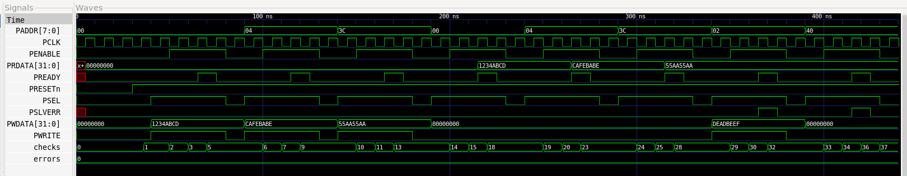

# APB UVM Verification

## Verification status

The portable smoke flow compiles the assertion checker with an Icarus-compatible procedural implementation. It was not executed here because Icarus was not installed. The bound SVA form and UVM environment were not run here.

## Repository

This repository contains the RTL/testbench/automation sources for the project. Review fixes are summarized in the package-level `CHANGES.md`.

# AMBA APB Protocol Verification

This is my third SystemVerilog verification project.

I designed a small APB slave and verified its setup and access phases, read and
write transfers, PREADY wait states, and PSLVERR responses. I used a
self-checking testbench for the portable regression and also created a reusable
UVM verification structure.

## What I Tested

- Reset behavior
- APB write and read transfers
- Setup and access phase timing
- PREADY wait-state handling
- Stable control signals while waiting
- Unaligned and out-of-range address errors
- Automatic comparison of read data with expected values

## Run

```bash
sudo apt-get update
sudo apt-get install -y iverilog gtkwave
make test
make wave
```

The terminal prints `APB_TEST_PASS` when every protocol and data check passes.

## Project Files

- `rtl/apb_slave.sv` - APB slave RTL
- `tb/smoke/apb_tb.sv` - portable self-checking regression
- `tb/uvm/` - UVM sequence, driver, monitor, scoreboard, coverage, and environment
- `tb/assertions/apb_assertions.sv` - APB protocol assertions
- `docs/test_plan.md` - verification plan
- `proof/` - generated test log, VCD, and waveform screenshot
- `.github/workflows/ci.yml` - Linux CI regression

## Waveform

The waveform shows APB setup and access phases, PREADY wait states, read/write
data, and PSLVERR behavior.



## Tools Used

- SystemVerilog
- UVM architecture
- Icarus Verilog
- GTKWave
- GitHub Actions
- Git

## Note

The PASS/FAIL result comes from the portable self-checking regression. The UVM
source and coverage model are included for architecture review; no unsupported
coverage percentage is claimed.
